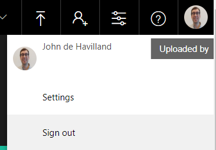
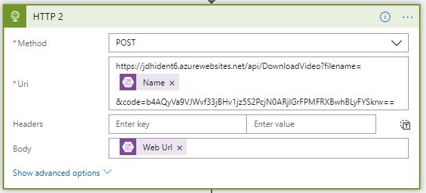
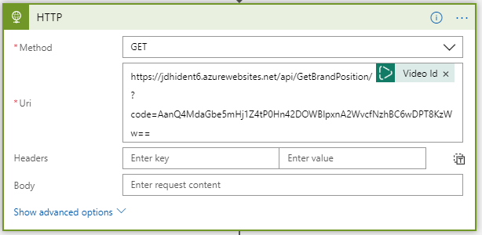
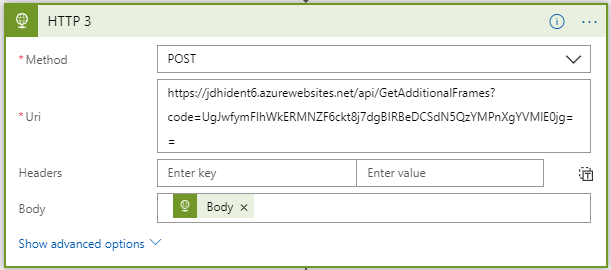

# Brand Identifier

This application identifies custom brands in video

## Setup

### Video Indexer

1. Setup your Video Indexer account. Go to [videoindexer.ai](https://videoindexer.ai) and log in with your corporate account. Once here, click on your name and choose settings.



2. Grab your account id and make a note of it somewhere.

3. Go to [https://api-portal.videoindexer.ai](https://api-portal.videoindexer.ai). 

4. Sign in and go to Products->Authorization and choose Subscribe.

5. Make a note of the Primary Key.


6. Go to [https://videobreakdown.portal.azure-api.net/](https://videobreakdown.portal.azure-api.net/).

7. Sign in and go to Products->Free Preview and subscribe.

8. Grab the Primary key.

### Custom Vision AI

1. Setup Custom Vision AI account - go to [customvision.ai](https://customvision.ai) and sign up (or log in).

2. Create a project.

3. Upload your images, tag them and press train.

4. Under the prediction tab, grab the Image endpoint and key.


### Deploy the infrastructure and code

1. Deploy the infrastructure components by clicking this button:
    <a href="https://ms.portal.azure.com/#create/Microsoft.Template/uri/https%3A%2F%2Fraw.githubusercontent.com%2Fswgriffith%2FBrandIdentifier%2Fmaster%2Fazure-deploy.json" target="_blank">
        
    </a>

This should deploy the following resources:


2. The key values you grabbed from the earlier stages are needed here (leave the rest as is):
* Function App Name - has to be globally unique
* Storage Account Name - has to be globablly unique
* Custom Vision URL - This was grabbed earlier
* Custom Vision Key - this is the access key grabbed earlier
* Video Indexer Id - this is the id of your VI account
* Video Indexer Key - This is the key you grabbed from api-portal.videoindexer.ai
* Video Indexer Key Logic - This is the key you grabbed from videobreakdown.portal.azure-api.net

3. Download the latest FunctionApp zip file from the releases folder in this repo.
6. Navigate to the FunctionApp code deploy page: https://<funtion_name>.scm.azurewebsites.net/ZipDeploy
7. Drag and drop the FunctionApp zip file into the file area on the ZipDeploy page.

### Wire it together

1. Grab the URL for each function app (there are 3 you need - ignore the CleanupFiles one). Do this by navigating to each function and pressing Get Function URL


2. Go to your logic app and choose edit.

3. Scroll down to the 3 http boxes at the end


4. Update the URLs as follows:







5. Press Save.

6. Go to your storage account and create 2 containers: **raw** and **results**. You can do this via the portal or via [Azure Storage Explorer](https://storageexplorer.com).

## Running It

To run this application you simply need to upload a video file to the RAW container. This will trigger the flow. Output is generated as .json file under the RESULTS container. The output will be something like this with times in hh:mm:ss.fff.

```
{
    "fileName": "tester1.mxf",
    "startTime": "00:00:00.2400000",
    "endTime": "00:00:05.1200000"
}
```
